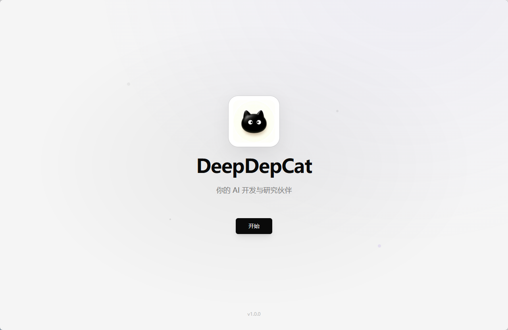
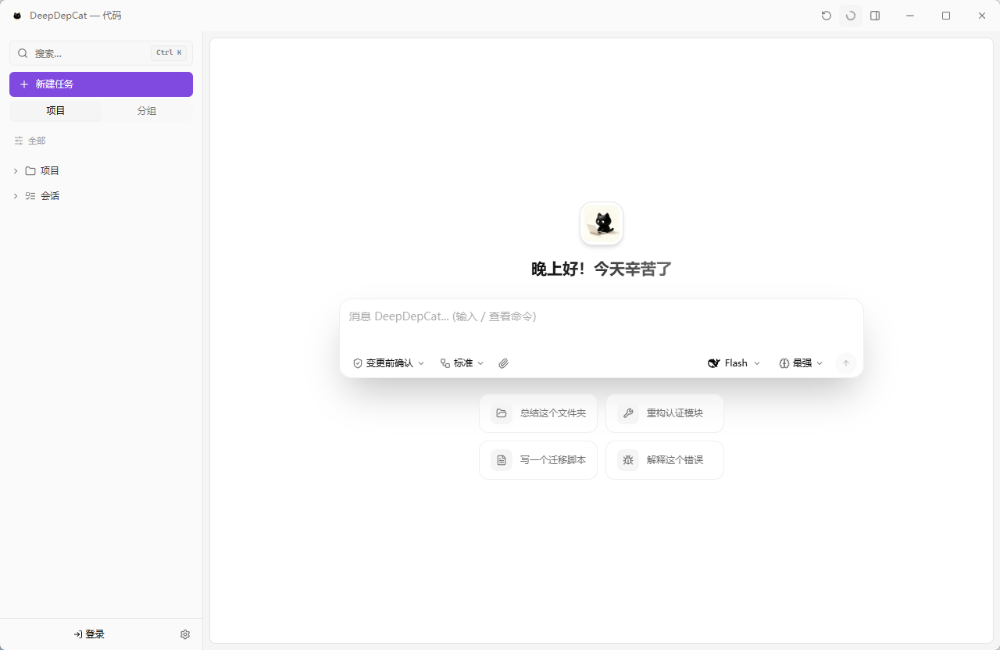
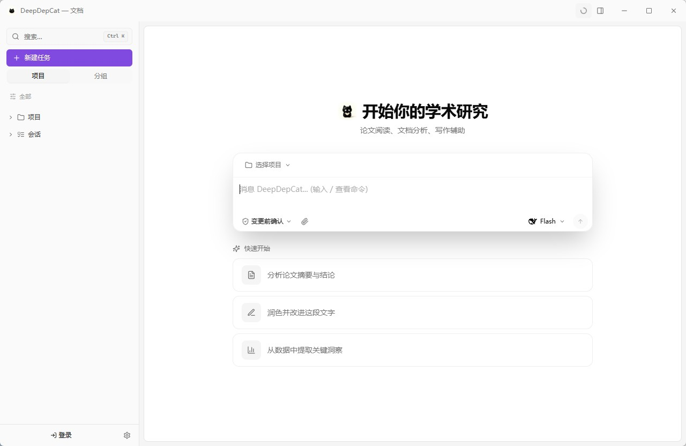

# DeepDepCat

**双工作流 AI 桌面工作台** — 一个原生桌面应用同时搞定编码与文档/办公自动化，原生深度集成 DeepSeek V4。

<p align="center">
  
  
  
  <a href="https://deepdepcat.hsmiai.xyz"></a>
  <a href="https://github.com/hanmirage/deepdepcat/releases"></a>
  <a href="https://github.com/hanmirage/deepdepcat/stargazers"></a>
</p>

<p align="center">
  
</p>

## 为什么选择 DeepDepCat

市面上的工具分两类：终端编码 Agent（只会写代码）与聊天客户端（只会聊天）。DeepDepCat 两者都不是——它两者都是，一个原生桌面应用：

- **Code 工作空间** — LSP 驱动的编码 Agent：子代理编排、多会话并行、执行策略（计划执行 / 反思优化 / 协调器 / 生成-评审）、检查点回滚、沙箱化工具执行，权限模式从「每次变更都确认」到「全自动」。
- **Depwork 工作空间** — 文档与办公自动化 Agent：Word/PPT/Excel 生成、OCR、表格处理、媒体转换、桌面 UI 自动化、批量文件操作——右侧任务面板实时显示分步进度，随时可暂停、可恢复。

DeepSeek V4 不是「外挂」——它就是核心：1M 上下文窗口、max 推理强度、思考过程流式展示、以及看得见的上下文缓存命中指标。

> 本仓库为 DeepDepCat 的产品主页、发布渠道与社区中心。桌面端源码在私有仓库开发；已开源组件也在此仓库（见[开源](#开源)）。欢迎任何问题、功能建议与反馈。

## 界面预览

<p align="center">
  
  
  
</p>

## 快速上手

1. 从 [Releases](https://github.com/hanmirage/deepdepcat/releases) 下载最新 Windows 安装包，或访问[官网](https://deepdepcat.hsmiai.xyz)。
2. 打开应用 — **设置 → 模型提供商**，选中内置 **DeepSeek** 提供商，填入你的 [DeepSeek API Key](https://platform.deepseek.com/api_keys)。
3. 添加模型 `deepseek-v4-pro` / `deepseek-v4-flash`（默认 1M 上下文窗口）。
4. 开始工作 — Code 工作空间写代码，Depwork 工作空间做文档。

## 核心特性

| 特性 | 说明 |
|------|------|
| 双工作流 | 编码 + 文档/办公自动化一体化，各自独立工具链、系统提示词、Agent 定义 |
| 多会话并行 | 会话互不阻塞并发运行；侧边栏实时状态 + 一键停止 |
| 子代理编排 | 复杂任务拆解为并行子代理，实时活动追踪 |
| 执行策略 | 标准 / 计划执行 / 反思优化 / 协调器 / 生成-评审（独立评估者） |
| 暂停与恢复 | 任务在检查点暂停（上下文完整保留）随时恢复——不是杀死 |
| DeepSeek V4 原生 | 1M 上下文、max 推理强度、思考流式展示、缓存命中指标 |
| 长期记忆 | 跨会话项目记忆自动注入，中文语义检索（FTS5 CJK） |
| 技能与生态 | 自有目录技能 + 兼容外部技能/插件——零格式转换 |
| MCP 支持 | 一等公民（stdio / SSE / HTTP），外部服务器工具并入统一注册表 |
| 检查点回滚 | 一键撤销 Agent 的任意文件改动——回到编辑前状态 |
| 信任与安全 | 4 级权限模式、沙箱执行、bash AST 安全分析、行内确认 |
| 静默更新 | 小版本退出时自动安装零打扰；大版本走更新按钮 |

## 开源

**WPS Office MCP 服务器**（`depwork-mcp/`）— 让任何 MCP 兼容的 AI 客户端直接操控 WPS Office（Writer / Calc / Impress）：文档创建与编辑、导出 docx/xlsx/pptx/pdf、以及向可见窗口逐字实时打字。JSON 项目模型 + 延迟 COM 渲染——编辑过程完全不需要 WPS 运行。

在 MCP 客户端中一段配置即可接入：

```json
{
  "mcpServers": {
    "wps-office": {
      "command": "python",
      "args": ["-m", "wps_controller.mcp_server"]
    }
  }
}
```

完整工具清单、CLI 用法与 JSON 项目格式见 [depwork-mcp/README.md](./depwork-mcp/README.md)。

## 平台支持

- **Windows (x64)** — 已可用（NSIS 安装包，静默更新）
- **macOS（Apple Silicon / Intel）** — Tauri 跨平台应用，构建中
- **Linux** — 规划中

## 技术栈

- **桌面壳**：[Tauri 2](https://tauri.app)（Rust 后端 + WebView2 / WebKit）
- **前端**：React 18 + TypeScript + Vite + Zustand
- **后端服务**：Python FastAPI + SQLite（更新 / 认证 / 遥测 / 同步）
- **模型**：DeepSeek V4（默认）、OpenAI、Anthropic、xAI Grok、本地 Ollama —— OpenAI / Anthropic / Responses 三协议

## 集成指南

- [DeepSeek 官方 awesome 清单指南](./docs/deepdepcat.zh-CN.md)（简体中文 · [English](./docs/deepdepcat.md)）

## 共创者

<a href="https://github.com/hanmirage"></a>
<a href="https://github.com/lm35260"></a>
